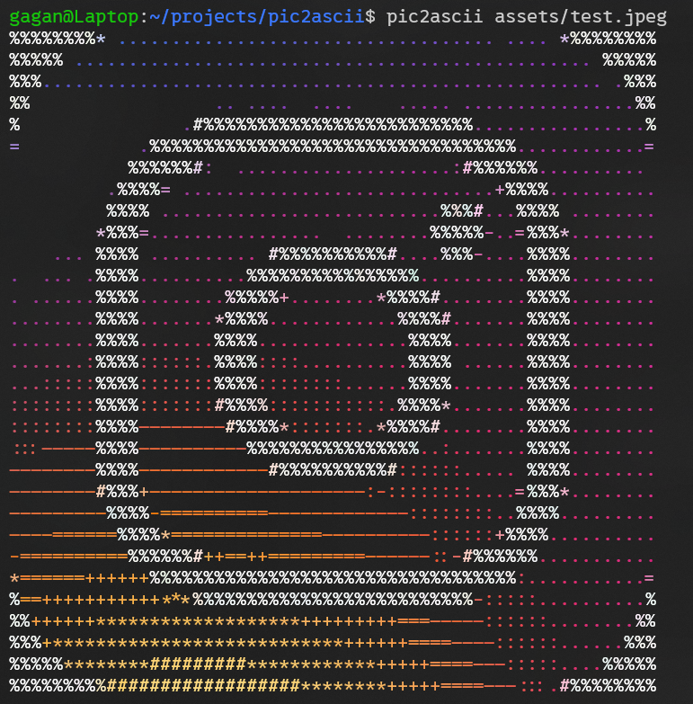
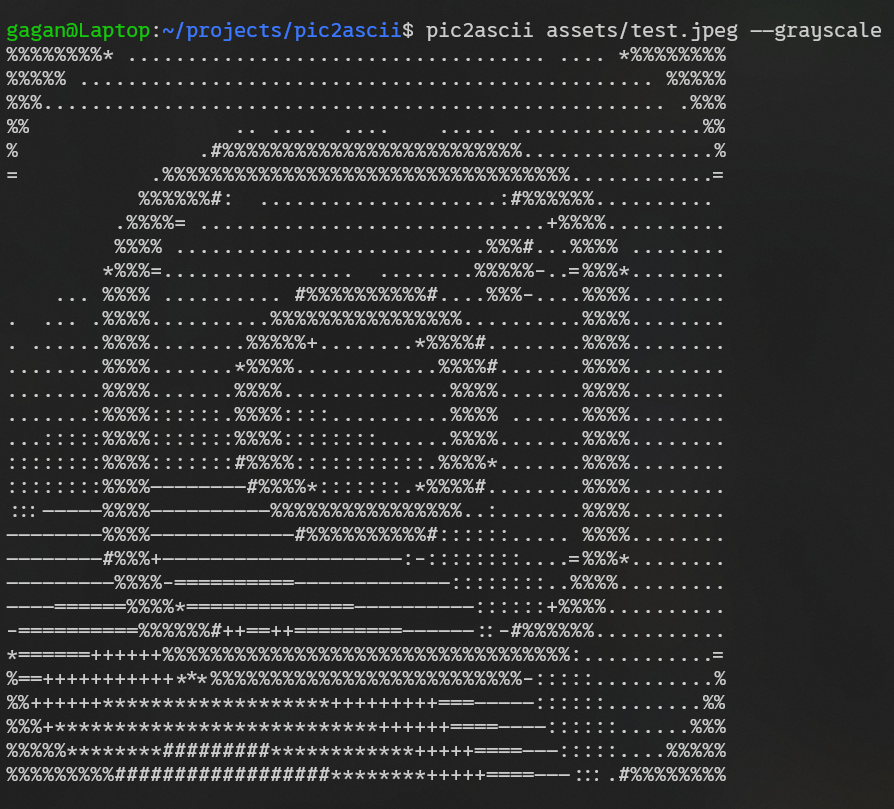

# 🖼️ pic2ascii — Convert any image to colorful ASCII art

**pic2ascii** is a lightweight C++ command-line tool that turns images into colorful or grayscale ASCII art, perfectly scaled for your terminal.  
It supports automatic width detection, custom sizing, text output, and more.

---

## 🚀 Features

- 🎨 Full color or grayscale output  
- ⚙️ Auto-fitting to your terminal width  
- ✨ Bilinear interpolation for smoother results  
- 📈 Adaptive contrast for better detail  
- 💾 Save output to a `.txt` file  
- 🖥️ Works on Linux, macOS, and Windows (via WSL)

---

## 🧩 Installation

Make sure you have a **C++17+ compiler** and **OpenCV** installed.

```bash
sudo apt update
sudo apt install g++ libopencv-dev
```
Then clone and build:

```bash
git clone https://github.com/<your-username>/pic2ascii.git
cd pic2ascii
mkdir -p build
g++ src/*.cpp -Iinclude -o build/pic2ascii
```
Run from build/:

```bash
Copy code
./build/pic2ascii --help
```
🧠 Usage
```bash
pic2ascii <image_path> [options]
```
### Options

| Flag | Description |
|------|--------------|
| `--width <n>` | Set custom output width (auto by default) |
| `--grayscale` | Output in black & white instead of color |
| `--output <file>` | Save ASCII art to a text file |
| `--help`, `-h` | Show help message |


### Examples
```bash
# Basic usage
pic2ascii myphoto.jpg

# Grayscale output
pic2ascii myphoto.jpg --grayscale

# Custom width
pic2ascii myphoto.jpg --width 120

# Save to file
pic2ascii myphoto.jpg --output out.txt
```

## 🧪 Example Output

### 🎨 Color Output
```bash
$ pic2ascii image.jpeg
```


⚫ Grayscale Output
```bash
$ pic2ascii image.jpeg --grayscale
```


## 🏗️ Project Structure
```
pic2ascii/
│
├── include/
│   ├── ascii.hpp
│   ├── image.hpp
│   └── utils.hpp
│
├── src/
│   ├── ascii.cpp
│   ├── image.cpp
│   ├── utils.cpp
│   └── main.cpp
│
├── build/
│   └── pic2ascii      # Compiled binary
│
└── README.md
```

## 💡 Tips

- Works best with high-contrast images.  
- For very detailed results, use `--width 120` or higher.  
- You can also manually redirect output:

```bash
./pic2ascii img.jpg > ascii.txt
```

## 🧑‍💻 Author
### Gagandeep Rai
Project built for fun and open-source contribution.

## 📜 License
MIT License — free for personal and commercial use.


